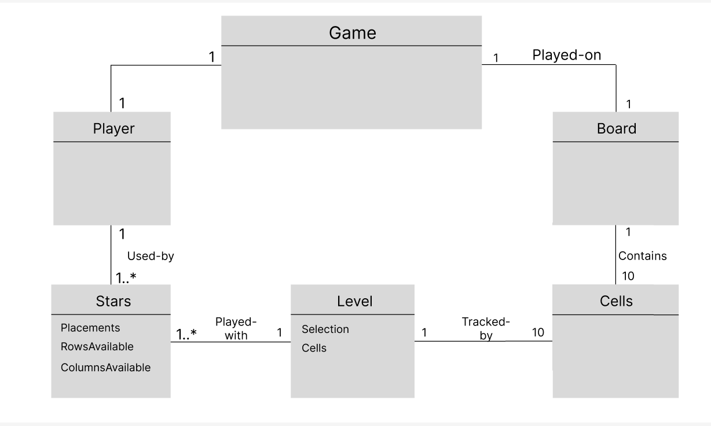
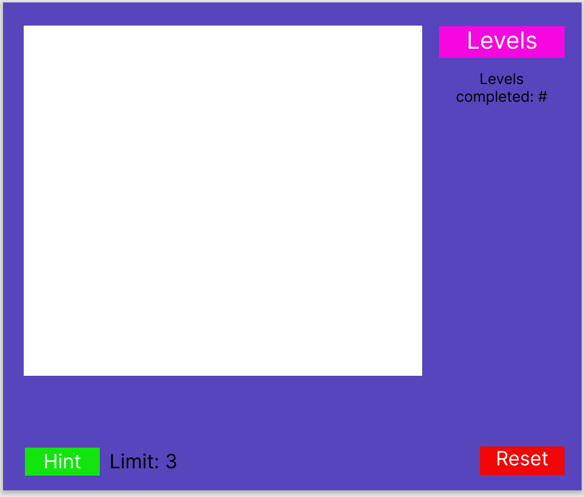
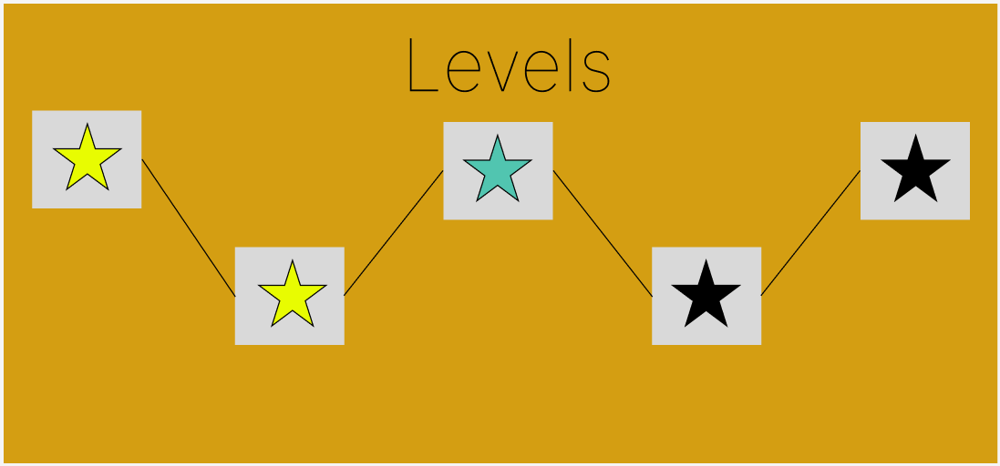
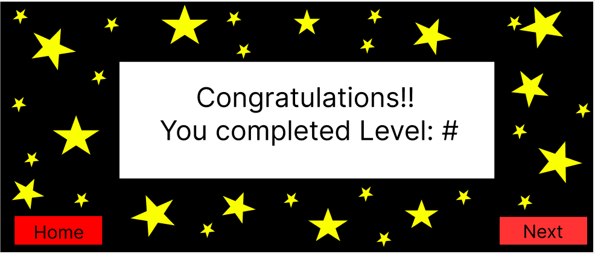
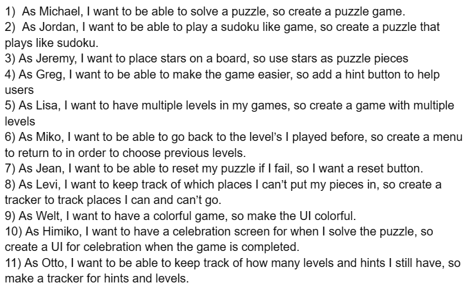

Place documentation within this directory for iteration 1.

Domain Model:

Game: The main UI.

Board: The grid/board used to play the game. One game
has one board.

Cells: The small miniature bolded parts of the Board. Each board contains
10 Cells.

Level: Each level contains 10 Cells and is different for each level.
A level tracks the Cells used on the board.

Stars: The stars are the pieces used to play on the board and the cells for each level.
A star should be able to track its placements as well as scan the rows and columns around it
to see if the a turn is playable. Multiple stars should be played on each level.

Player: The main user of the game. One player should be able to play one game.

UI Sketches:

Grid: The Board. Main place to play the game

Levels: A Button capable of returning you to a menu where you can return to previous level's you've completed.

Level completed: A tracker tracking how many levels user has completed

Reset: Reset's the level/Clears the board

Hint: A button that helps users by highlights possible moves user can do.

Limit: A tracker that shows the amount of hints user has.

Level Selection UI: When on the main UI, you can chose the button "Levels" in order to go back
to the level selection scree. Saves all your progress and shows every level completed and every level
stil uncompleted. 

Yellow stars = completed

Black stars = uncompleted

Gray stars = attempted, but still incomplete

LevelCompletionUI: When finishing a level, this UI will show up and
say congratulations. Level completed will be displaced in Text. Only when
the current level is completed can you then move on to the next level.

Next: A Button that takes you to the next level.

Home: A Button that takes you to the Level Selection UI.

User Stories:

